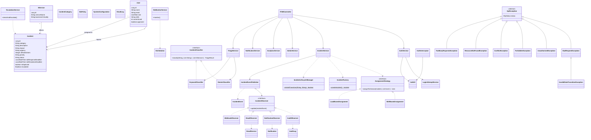

# Class Diagram

```mermaid
classDiagram
    class User {
        Long id
        String name
        String email
        UserRole role
        String skills
        int currentLoad
        boolean approved
    }
    class Incident {
        Long id
        String category
        String description
        String impact
        String urgency
        Integer affectedUsers
        String priority
        String status
        LocalDateTime slaResponseDeadline
        LocalDateTime slaResolutionDeadline
        boolean isDuplicate
        Boolean escalated
    }
    class ItService {
        Long id
        String serviceName
        String businessCriticality
    }
    class IncidentCategory
    class SlaPolicy
    class SystemConfiguration
    class AuditLog
    class Notification
    class EmailLog
    class SlaViolation

    User "1" --> "*" Incident : reports
    User "1" --> "*" Incident : assigned to
    ItService "1" --> "*" Incident : affects

    class AssignmentStrategy {
        <<interface>>
        +assignTechnician(Incident, List~User~) User
    }
    AssignmentStrategy <|.. SkillBasedAssignment
    AssignmentStrategy <|.. LoadBasedAssignment

    class IncidentClassifier {
        <<interface>>
        +classify(String, List~String~, List~ItService~) TriageResult
    }
    IncidentClassifier <|.. GeminiClassifier
    IncidentClassifier <|.. KeywordClassifier
    TriageService --> GeminiClassifier
    TriageService --> KeywordClassifier

    class IncidentObserver {
        <<interface>>
        +update(IncidentEvent)
    }
    IncidentObserver <|.. AuditObserver
    IncidentObserver <|.. NotificationObserver
    IncidentObserver <|.. EmailObserver
    IncidentObserver <|.. WebhookObserver
    IncidentEventPublisher o--> IncidentObserver
    IncidentEventPublisher ..> IncidentEvent
    AuditObserver ..> AuditLog
    NotificationObserver ..> Notification
    EmailObserver ..> EmailService

    class IncidentFactory {
        +createIncident() Incident$
    }
    class IncidentLifecycleManager {
        +isValidTransition(String, String) boolean$
    }

    class ITSMController
    ITSMController --> AuthService
    ITSMController --> IncidentService
    ITSMController --> AdminService
    ITSMController --> AnalyticsService
    ITSMController --> NotificationService
    ITSMController --> TriageService

    IncidentService ..> AssignmentStrategy
    IncidentService ..> IncidentFactory
    IncidentService ..> IncidentLifecycleManager
    IncidentService --> IncidentEventPublisher
    AuthService --> LoginAttemptService
    AuthService --> JwtUtil
    AuthInterceptor --> JwtUtil

    class EscalationService {
        +checkAndEscalate()
    }
    class SlaMonitorService {
        +monitor()
    }
    EscalationService ..> Incident
    SlaMonitorService ..> SlaViolation

    class ApiException {
        <<abstract>>
        HttpStatus status
    }
    ApiException <|-- BadRequestException
    ApiException <|-- UnauthorizedException
    ApiException <|-- ForbiddenException
    ApiException <|-- ConflictException
    ApiException <|-- ResourceNotFoundException
    ApiException <|-- TooManyRequestsException
    BadRequestException <|-- InvalidStateTransitionException
```